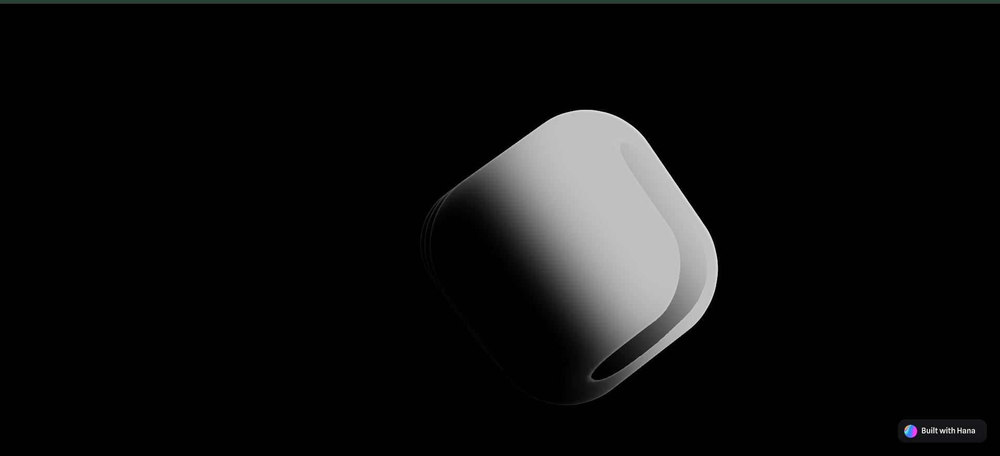
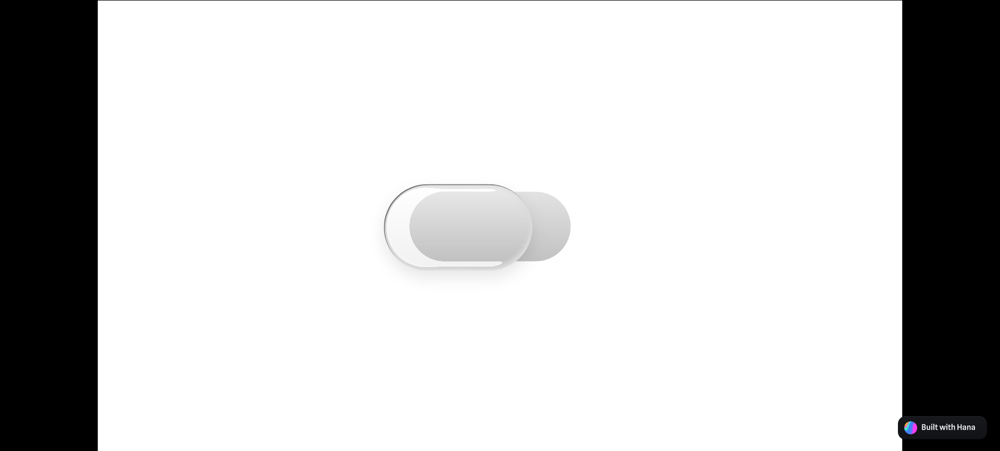

# 🕶️ Spline 3D Projects – by Hilal Prayogi

Selamat datang di showcase kecil proyek 3D saya yang dibuat menggunakan [Spline](https://spline.design/).  
Di bawah ini ada dua eksperimen visual yang saya buat: **Glasses Bounce** dan **Toggle Glass Effect**.

---

## 🎯 Tujuan Proyek

Eksplorasi bentuk, interaksi, dan animasi 3D dalam desain antarmuka berbasis web.  
Saya mencoba menggabungkan pengalaman visual interaktif dengan elemen desain minimalis tapi menarik.

---

## 🔮 Project 1 – Glasses Bounce

> Efek kaca dengan pantulan dinamis & interaktif

🖼️ **Preview**  
 <!-- Ganti dengan thumbnail jika ada -->

🔗 **Live View:**  
[👉 Lihat Project Glasses Bounce](https://my.spline.design/untitled-GVsXUvRnC782iuttrsLcjlS5-CjF/)

---

## 🧊 Project 2 – Toggle Glass Effect

> Eksperimen efek toggle interaktif dengan elemen kaca

🖼️ **Preview**  
 <!-- Ganti dengan thumbnail jika ada -->

🔗 **Live View:**  
[👉 Lihat Project Toggle Glass](https://my.spline.design/togleglasseffect-1Fu3eoufYnVQV6iV6gvnqiaC-QN3/)

---

## ⚙️ Tools & Teknologi

- 🧩 [Spline 3D](https://spline.design/) – Real-time 3D design tool
- 🎨 Fokus pada efek interaktif dan tampilan transparan kaca
- 🌐 Hosted via Spline cloud

---

## 🧠 Catatan

✨ Kedua project ini masih dalam tahap eksplorasi, saya terbuka untuk masukan dan kolaborasi!  
Silakan fork atau kasih bintang kalau kamu suka 💫

---

> Terima kasih sudah mampir! 🙌 Jangan lupa explore dan coba interaksinya langsung ya!
